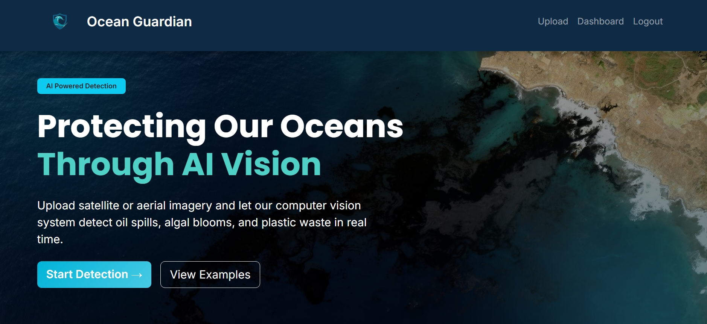
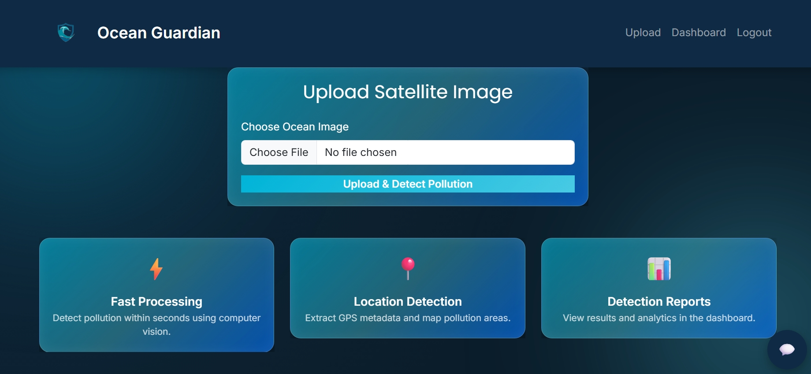
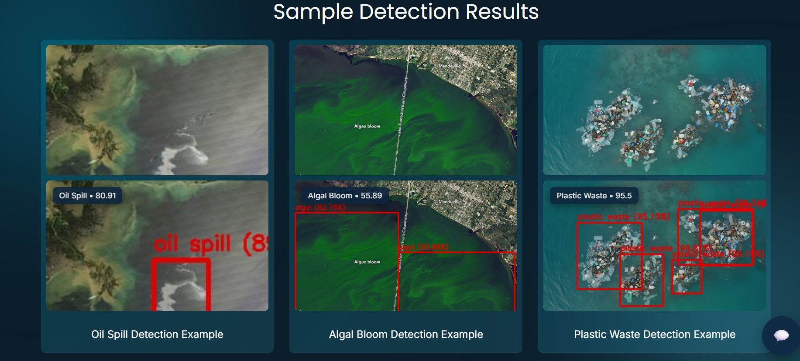
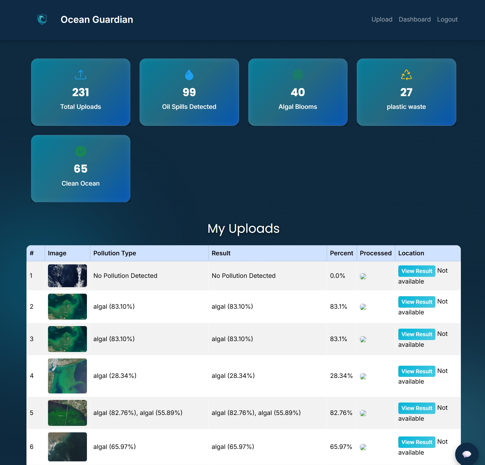
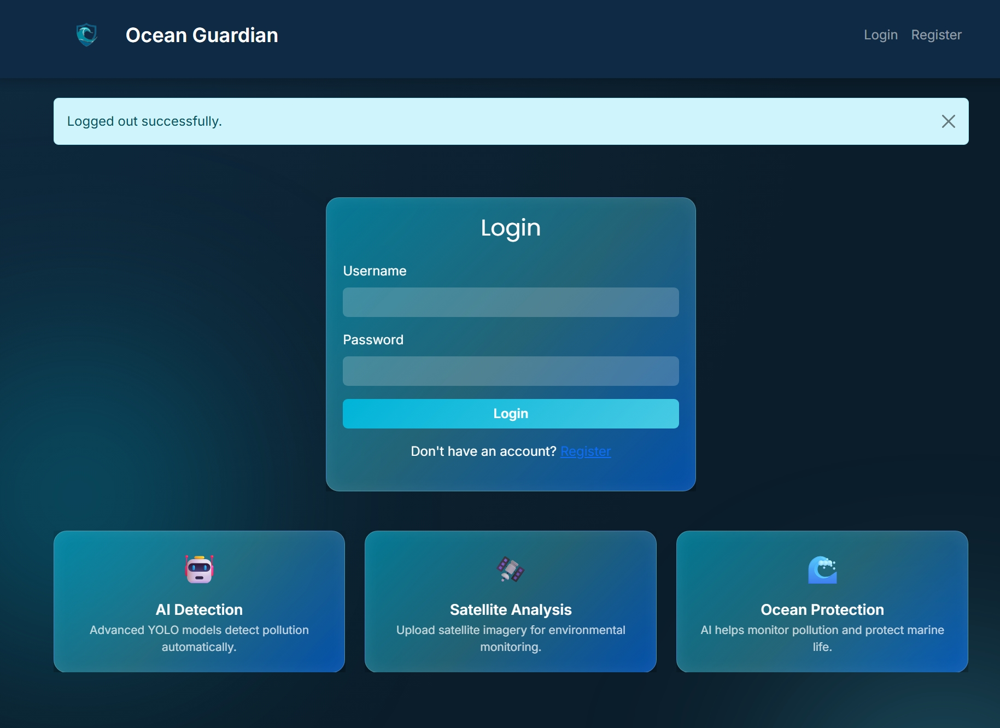
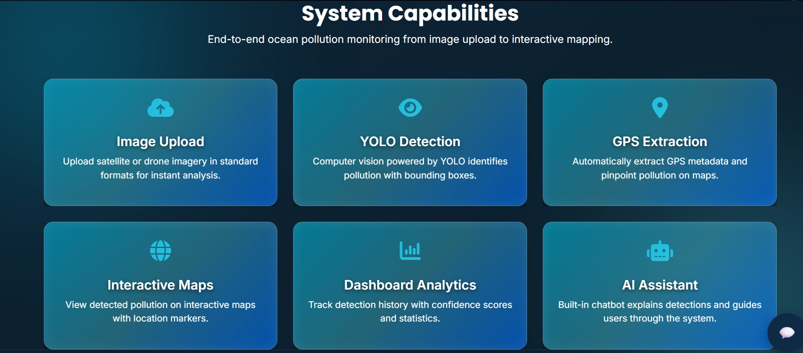

# 🌊 Ocean Pollution Detection System

## 📌 Overview

The **Ocean Pollution Detection System** is a web-based application designed to identify and visualize ocean pollution using computer vision techniques. The system allows users to upload satellite or aerial images and detects pollution types such as **oil spills, algal blooms, and plastic waste**.

The application integrates **AI-based detection (YOLO)** with an interactive web interface built using Flask, enabling users to analyze environmental data efficiently.

---

## 🎯 Objectives

* Detect ocean pollution from uploaded images
* Classify pollution types (oil spill, algal bloom, plastic waste)
* Visualize detected regions with highlighted outputs
* Provide confidence percentage for detections
* Display geographic location on an interactive map
* Maintain user-specific upload history

---

## 🚀 Features

### 🔐 User Authentication

* User registration and login system
* Secure session handling

### 🖼 Image Upload & Processing

* Upload satellite or drone images
* Process images using YOLO object detection model
* Display original and processed images side-by-side

### 🧠 AI-Based Detection

* Detect multiple pollution types:

  * Oil spills
  * Algal blooms
  * Plastic waste
* Highlight polluted regions in the image
* Show confidence percentage

### 📍 Location Mapping

* Extract GPS coordinates (if available)
* Display location on an interactive map using Leaflet.js

### 📊 Dashboard

* View previously uploaded images
* Access detection results
* Navigate to detailed result pages

### 🤖 Chatbot (Basic)

* Provides information about the system
* Assists users with navigation

### 📱 Responsive UI

* Works on desktop and mobile devices
* Modern dark-themed interface with gradient styling

---

## 🛠️ Technologies Used

### 🔹 Backend

* Python
* Flask

### 🔹 Frontend

* HTML5
* CSS3
* Bootstrap
* JavaScript

### 🔹 AI / ML

* YOLO (You Only Look Once)
* OpenCV

### 🔹 Database

* SQLite

### 🔹 Mapping

* Leaflet.js

---

## 🏗️ Project Structure

```
ocean_guardian/
│
├── app.py
├── requirements.txt
├── README.md
│
├── templates/
│   ├── login.html
│   ├── register.html
│   ├── dashboard.html
│   ├── upload.html
│   ├── result.html
│
├── static/
│   ├── css/
│   ├── js/
│   ├── images/
│
├── analysis/
│   └── processor.py
│
├── ml_model/
│   └── (trained YOLO model files)
```

---

## ⚙️ Installation & Setup

### 1️⃣ Clone the Repository

```bash
git clone https://github.com/Mokshagna-Raju/ocean-pollution-detection.git
cd ocean-pollution-detection
```

---

### 2️⃣ Create Virtual Environment

```bash
python -m venv venv
```

Activate it:

**Windows:**

```bash
venv\Scripts\activate
```

---

### 3️⃣ Install Dependencies

```bash
pip install -r requirements.txt
```

---

### 4️⃣ Run the Application

```bash
python app.py
```

---

### 5️⃣ Open in Browser

```id="browser_url"
http://127.0.0.1:5000
```

---

## 🔄 Workflow

1. User logs into the system
2. Uploads an ocean image
3. Image is processed using YOLO model
4. Pollution type and confidence are detected
5. Processed image is generated
6. Location is extracted (if available)
7. Results displayed with map visualization
8. Data stored in dashboard

---

## ⚠️ Limitations

* Detection accuracy depends on training data
* No real-time satellite integration
* SQLite database (not scalable for large systems)
* Model performance may vary for different image qualities

---

## 🔮 Future Enhancements

* Real-time satellite data integration
* Cloud storage for images
* Advanced AI chatbot integration (OpenAI / Gemini)
* Improved model accuracy with larger datasets
* User analytics dashboard
* Deployment with scalable database (PostgreSQL)

---

## 🌐 Deployment

The project can be deployed using:

* Render
* Heroku
* AWS

---

## 👨‍💻 Author

**Mokshagna Raju**

---

## 📌 Conclusion

This project demonstrates how **AI and web technologies** can be combined to build an intelligent system for environmental monitoring. It provides a foundation for future advancements in ocean pollution detection and analysis.


## Screenshots

### Home Page


### Upload Page


### Detection Result


### Dashboard


### Login


### System capabilities

